<!--  显示图片链接-->
<!-- 基本语法网站 https://shd101wyy.github.io/markdown-preview-enhanced/#/zh-cn/markdown-basics?id=%E9%93%BE%E6%8E%A5 -->

# 移动端ReactNative介绍
## ReactNative的介绍
React Native 让开发者使用 JavaScript 和 React 编写应用，利用相同的核心代码就可以创建 iOS 和 Android 跨平台的原生应用，React Native 的宗旨是，学习一次，高效编写跨平台原生应用。[ReactNative官网](https://facebook.github.io/react-native/)

## 开发需要了解的基础知识
- [HTML5](http://www.w3school.com.cn/html5/)
- [JavaScript](http://www.w3school.com.cn/js/index.asp)
- [CSS3](http://www.w3school.com.cn/css3/)
- [React](https://reactjs.org/)
- [ReactNative](https://facebook.github.io/react-native/)

## 开发需要安装的工具
- [JDK的相关配置](https://www.cnblogs.com/smyhvae/p/3788534.html)
  - [JDK8下载](http://www.oracle.com/technetwork/java/javase/downloads/jdk8-downloads-2133151.html)
- [Git的相关配置](https://www.jianshu.com/p/f5b4ba099f66)
  - [Git下载](https://www.git-scm.com/downloads)
- [AndroidStudio的相关配置](https://blog.csdn.net/Piston_zg/article/details/77284116)
  - [AndroidStudio下载](http://www.android-studio.org/)
- [Nodejs的相关配置](https://www.cnblogs.com/liuqiyun/p/8133904.html)
  - [Nodejs下载](https://nodejs.org/en/download/)
- [VSCode的相关配置](https://jingyan.baidu.com/article/642c9d3430c2ec644a46f7d6.html)
  - [VSCode下载](https://code.visualstudio.com/)

## ReactNative环境的配置
#### 开发工具VSCode插件的安装
打开VSCode,在拓展里面搜索以下插件进行安装
- `EditorConfig for VS Code`设置文件的编码格式
- `ESLint`编码格式的检测工具
- `JavaScript (ES6) code snippets`此扩展包含用于VS代码编辑器的ES6语法中的JavaScript代码段
- `React Native Tools`编辑ReactNative时候代码片段的提示工具
- `Reactjs code snippets`编辑React时候代码片段的提示工具

#### 真机开发安卓手机的设置

1. 设置手机为开发者模式（设置->关于手机->连续点击MIUI版本——开启成功）

2. 在更多设置中找到系统安全设置——允许安装未知来源的应用

3. 在更多设置中选择开发者选项，在开发者选项中同时勾选USB调试和USB安装的开关


#### 电脑开发环境的配置，具体请参考官网[ReactNative环境配置](https://facebook.github.io/react-native/docs/getting-started.html)

在你的工作目录下面右击鼠标，点击GitBush 会弹出git命令窗口，执行以下命令：

1. 安装ReactNative的cli

`npm install -g react-native-cli`

2. 可以安装[yarn](https://blog.csdn.net/yw00yw/article/details/81354533)来替换npm的命令
`npm install -g yarn`

3. 创建ReactNative工程

`react-native init react-native-demo`

指定具体版本：`react-native init react-native-demo --version 0.55.4`

4. 进入创建工程的文件夹下

`cd react-native-demo`

5. 手机连接电脑，执行下面的命令安装应用到手机

`react-native run-android`

6. 如果应用安装成功并且显示下图表示开发环境配置成功

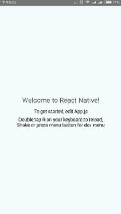


## 工程的目录介绍

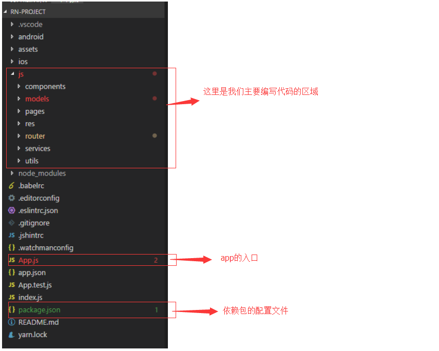

#### android和ios文件

android和ios文件夹如果我们不做原生开发不需要关心他们，我们写的React代码会在打包的时候会自动发布到ios和android工程里面

#### App.js文件的介绍

App.js是项目的入口文件

#### package.json文件的介绍

package.json里面放的是我们工程所用到的一些依赖，如果之后有新的依赖我们都会通过这个文件来管理

#### js文件夹目录的介绍

我们的主要编码工作在这个文件夹下面

#### demo工程会用到的一些依赖介绍

- [react-native-swiper](https://github.com/leecade/react-native-swiper)

`react-native-swiper是一个滑动轮播组件`

- [react-navigation](https://reactnavigation.org/docs/en/getting-started.html/)

`页面导航的使用`


## 代码说明

#### 工程Git地址
`https://github.com/fenglipk/react-native-demo.git`

#### 工程基础配置

自己动手从头开始安装插件

```javascript
react-native init react-native-demo

cd react-native-demo

yarn 或者 npm install

yarn add react-navigation

yarn add react-native-reanimated  
yarn add react-native-gesture-handler
yarn add react-native-screens@^1.0.0-alpha.23

react-native link react-native-reanimated
react-native link react-native-gesture-handler
react-native link react-native-screens

yarn add react-navigation-stack

yarn add react-native-swiper@nightly

react-native run-android
```
从demo工程初始化和插件的安装

```javascript
git clone https://github.com/fenglipk/react-native-demo.git

cd react-native-demo

yarn 或者 npm install

react-native link react-native-reanimated
react-native link react-native-gesture-handler
react-native link react-native-screens

react-native run-android
```

## 调试工具

我们在工程目录下面右击鼠标选则git bash,会弹出命令窗口输入 yarn start 启动工程服务，启动成功后如下图

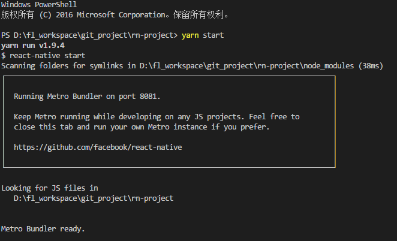


摇一摇手机 会弹出 Developer Menu对话框 这里面有我们开发时候会用到的一些调试工具 （模拟器是 ctrl + m）

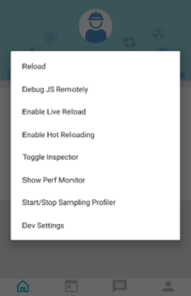

#### reload

点击reload会重新加载页面，如果有异常，则会返回异常给手机，我们需要修复这些异常，然后再重新reload

#### Dev Settings

如果APP提示没有连接到Server就需要给手机配置启动服务电脑的IP地址，点击Dev Setting 再点击Debug Server Host 配置IP，配置好后再执行reload重新加载页面

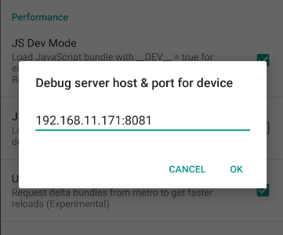

#### Debug JS Remotely  

该功能可以通过浏览器调试APP代码,类似google浏览器的调试工具的使用
1. 安装react-devtools，右击鼠标 打开git bash命令窗口 输入 npm install -g react-devtools 进行安装

2. google浏览器调试会有跨域的问题，我是安装跨域的插件allow-control-allow-origin来解决的

3. 以上两步完成后点击Debug JS Remotely，此时会弹出浏览器调试页面，能看到工程的代码目录表示浏览器调试工具启动成功

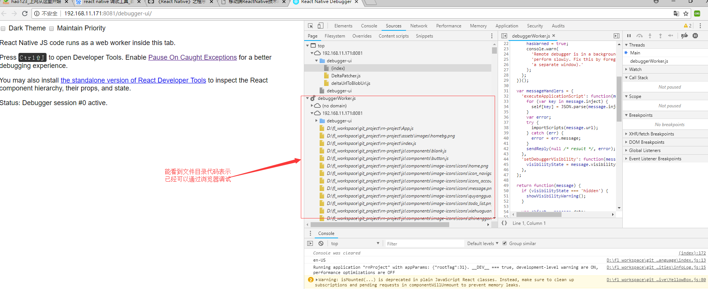

#### Enable Live Reload

使用这个功能可以修改代码保存后直接自动reload，取消该功能点击 disable live reload 既可

#### Enable hot Reloading

使用这个功能可以实现修改某个页面后保存只刷新这个页面而不用所有页面重新加载 ，取消该功能点击 disable hot reload 既可

#### Toggle Inspector

点击后可以 看到四个选择项目 `inspect` `pref` `network` `touchables`

点击`inspect`功能后点击某个元素可以查看该元素的布局

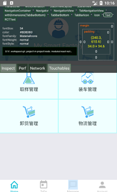

点击`network`后可以看到应用发出了那些请求

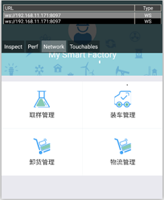

点击`touchables`后会把view用格子给标注出来


点击`pref`后可以


<!-- #### Show Perf Monitor -->

点击后可以查看app占用内存 UI渲染帧率等信息

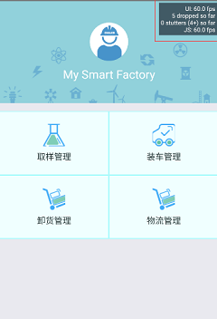 

<!-- #### start/stop Sampling Profiler -->

#### react-devtools 的使用
1. 安装react-devtools的命令 npm install -g react-devtools

2. 打开命令输入行 执行 react-devtools 弹出如下窗口说明安装成功

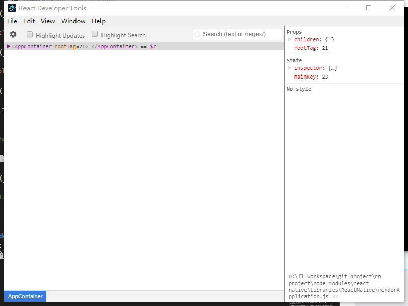 

3. 摇一摇手机，选择Toggle Inspector 选中inpect后 点击屏幕的页面元素，该调试工具会定位到元素代码的位置，开发人员可以查看相关元素的信息

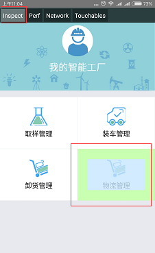

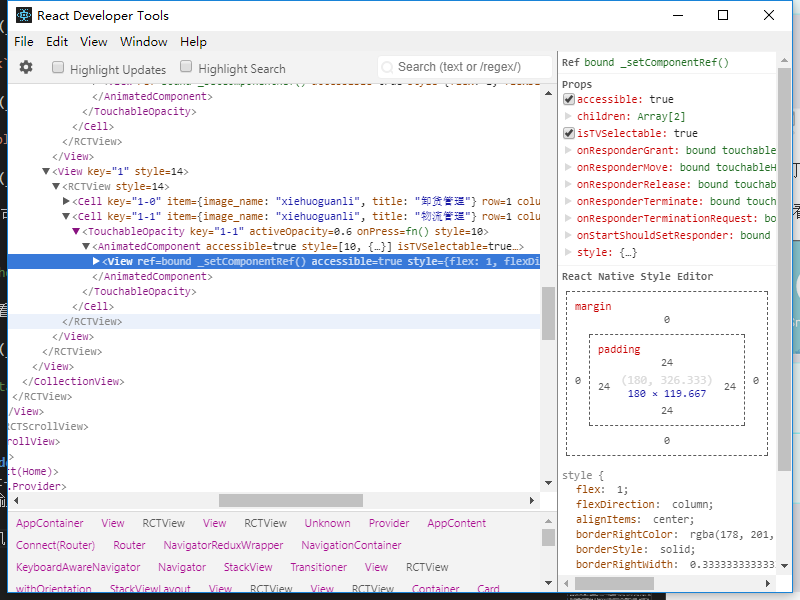  
4. 和步骤三相反，鼠标移动到调试工具的某个页面元素，手机对应的元素也会高亮显示

 


