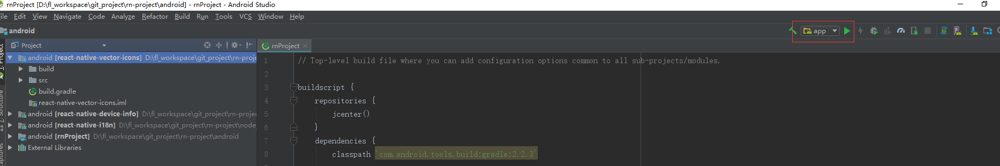

<!--  显示图片链接-->
<!-- 基本语法网站 https://shd101wyy.github.io/markdown-preview-enhanced/#/zh-cn/markdown-basics?id=%E9%93%BE%E6%8E%A5 -->

# 移动端ReactNative技术架构介绍
## ReactNative的介绍
React Native 让开发者使用 JavaScript 和 React 编写应用，利用相同的核心代码就可以创建 iOS 和 Android 跨平台的原生应用，React Native 的宗旨是，学习一次，高效编写跨平台原生应用。[ReactNative官网](https://facebook.github.io/react-native/)

## 开发需要了解的基础知识
- [HTML5](http://www.w3school.com.cn/html5/)
- [JavaScript](http://www.w3school.com.cn/js/index.asp)
- [CSS3](http://www.w3school.com.cn/css3/)
- [React](https://reactjs.org/)
- [ReactNative](https://facebook.github.io/react-native/)
- [Redux](https://redux.js.org/)
- [Dva](https://dvajs.com/)

## 开发需要安装的工具
- [JDK的相关配置](https://www.cnblogs.com/smyhvae/p/3788534.html)
  - [JDK8下载](http://www.oracle.com/technetwork/java/javase/downloads/jdk8-downloads-2133151.html)
- [Git的相关配置](https://www.jianshu.com/p/f5b4ba099f66)
  - [Git下载](https://www.git-scm.com/downloads)
- [AndroidStudio的相关配置](https://blog.csdn.net/Piston_zg/article/details/77284116)
  - [AndroidStudio下载](http://www.android-studio.org/)
- [Nodejs的相关配置](https://www.cnblogs.com/liuqiyun/p/8133904.html)
  - [Nodejs下载](https://nodejs.org/en/download/)
- [VSCode的相关配置](https://jingyan.baidu.com/article/642c9d3430c2ec644a46f7d6.html)
  - [VSCode下载](https://code.visualstudio.com/)

## ReactNative环境的配置
#### 开发工具VSCode插件的安装
打开VSCode,在拓展里面搜索以下插件进行安装
- `EditorConfig for VS Code`设置文件的编码格式
- `ESLint`编码格式的检测工具
- `JavaScript (ES6) code snippets`此扩展包含用于VS代码编辑器的ES6语法中的JavaScript代码段
- `React Native Tools`编辑ReactNative时候代码片段的提示工具
- `Reactjs code snippets`编辑React时候代码片段的提示工具

#### 真机开发安卓手机的设置

1. 设置手机为开发者模式（设置->关于手机->连续点击MIUI版本——开启成功）

2. 在更多设置中找到系统安全设置——允许安装未知来源的应用

3. 在更多设置中选择开发者选项，在开发者选项中同时勾选USB调试和USB安装的开关


#### 电脑开发环境的配置，具体请参考官网[ReactNative环境配置](https://facebook.github.io/react-native/docs/getting-started.html)

在你的工作目录下面右击鼠标，点击GitBush 会弹出git命令窗口，执行以下命令：

1. 安装ReactNative的cli

`npm install -g react-native-cli`

2. 可以安装yarn来替换npm的命令

`npm install -g yarn`

3. 创建ReactNative工程

`react-native init AwesomeProject`

指定具体版本：`react-native init AwesomeProject --version 0.55.4`

4. 进入创建工程的文件夹下

`cd AwesomeProject`

5. 手机连接电脑，执行下面的命令安装应用到手机

`react-native run-android`

6. 如果应用安装成功并且显示下图表示开发环境配置成功


## 工程的目录介绍


#### android和ios文件

android和ios文件夹如果我们不做原生开发不需要关心他们，我们写的React代码会在打包的时候会自动发布到ios和android工程里面

#### App.js文件的介绍

App.js是项目的入口文件

#### package.json文件的介绍

package.json里面放的是我们工程所用到的一些依赖，如果之后有新的依赖我们都会通过这个文件来管理

#### js文件夹目录的介绍

我们的主要编码工作在这个文件夹下面

- `component`封装的公共组件
- `model`处理UI页面的业务逻辑，UUI页面可以通过发送action给model来处理请求然后把结果通过更新state状态值来更新页面。 
- `pages`UI页面
  - `login` 登录
  - `main-tabs` 主页面
  - `其他...` 
- `res`配置公共样式和国际化的文件
- `router`页面路由的相关文件
- `services`APP做服务请求的相关代码
- `utils`一些公用的工具方法

#### 工程会用到的一些依赖介绍

- [dva-core](https://dvajs.com/)

`dva 是基于 redux 最佳实践 实现的 framework，简化使用 redux 和 redux-saga 时很多繁杂的操作`

- [react-native-device-info](https://github.com/rebeccahughes/react-native-device-info)

`用来获取设备相关信息`

- [react-navigation](https://reactnavigation.org/)

`页面导航的使用`

- [react-native-vector-icons图标](https://oblador.github.io/react-native-vector-icons/) [git地址](https://oblador.github.io/react-native-vector-icons/)

`图标的使用`

- [PropType](https://github.com/facebook/prop-types)

`对react组件中props对象中的变量进行类型检测`


## 代码说明

#### 工程Git地址
`git@git.cs2025.com:apps/rn-project.git`

#### 入口文件

入口文件基本都配置好了，下面做一些大致的说明

APP.js是入口文件，代码里面加载的是AppContent，他的里面是一个路由Router

```javascript
const app = dva({
  initialState: {}, // 配置一些初始化的state值
  models: [...Models], // 把model放入dva进行管理
  extraReducers: { router: routerReducer }, // 把导航路由交给redux管理，简单说就是配置了这里就可以在model里面通过dispatch进行页面跳转
  onAction: [createLogger(), routerMiddleware], // 在此放置路由中间件，和routerReducer配套使用
  onError(e) { // 打印全局错误日志
    console.log('onError', e);
  },
});

const App = app.start(<AppContent />); // 根视图

registerAppStore(app._store);

export default App;
```

AppContent里面是一个路由Router,Router里面加载是一个导航AppNavigator

```javascript
// 创建导航页面
const AppNavigator = createStackNavigator(
  // 导航里面的页面，其中页面也可以是一个导航比如这里的MainNavigator，我们之后主要的业务是在Main页面上进行拓展
  {
    Main: { screen: MainNavigator },
    Login: { screen: Login },
  },
  {
    initialRouteName: 'Main', // 设置初始加载页面
    headerMode: 'none',
    mode: 'modal',
    navigationOptions: {
      gesturesEnabled: false,
    },
   ...
  },
);

// 下面两步是把routerReducer和routerMiddleware配置给APP.js文件的dva实现对路由的管理，实现在model和组件里面能够使用NavigationActions.navigate()进行页面跳转等

// 创建导航的路由Reducer给redux管理
export const routerReducer = createNavigationReducer(AppNavigator);

// 创建导航中间件并把路由交给state
export const routerMiddleware = createReactNavigationReduxMiddleware(
  'root',
  state => state.router,
);

// 把导航绑定在root上
const Root = reduxifyNavigator(AppNavigator, 'root');

// 获取路由的名称
const getActiveRouteName = (navigationState) => {
  if (!navigationState) {
    return null;
  }
  const route = navigationState.routes[navigationState.index];
  if (route.routes) {
    return getActiveRouteName(route);
  }
  return route.routeName;
};

// 返回给App.js的Router
@connect(({ app, router }) => ({ app, router }))
class Router extends PureComponent {
  componentWillMount() { // 绑定退回按钮事件
    BackHandler.addEventListener('hardwareBackPress', this.backHandle);
  }

  componentWillUnmount() { // 取消绑定退回按钮事件
    BackHandler.removeEventListener('hardwareBackPress', this.backHandle);
  }

  // 定义那些页面可以返回
  backHandle = () => {
    const currentScreen = getActiveRouteName(this.props.router);
    if (currentScreen === 'Login') {
      return true;
    }
    if (currentScreen !== 'Main') {
      this.props.dispatch(NavigationActions.back());
      return true;
    }
    return false;
  }

  render() {
    const { app, dispatch, router } = this.props;
    if (app.loading) return <Loading />;

    return <Root dispatch={dispatch} state={router} />;
  }
}

export default Router;
```

#### 示例 登录页面

下面用登录部分对如何创建一个页面进行说明

一般步骤 `1.新建一个component展示UI页面` `2.新建model处理UI页面的业务逻辑` `3.把component注册到导航里面` `4.如果涉及到网络请求的话再新建一个service处理网络请求`

- 新建一个component展示UI页面，比如Pages/login文件夹下面的index.js为登录的UI页面

```javascript
@connect(({ auth }) => ({ // 把models里面的auth和LoginPage对应起来
  auth,
}))
class LoginPage extends Component {
  @Debounce(400, {
    leading: true,
    trailing: false,
  })
  onLogin() { // 处理登录请求 发送action给auth进行处理
    this.props.dispatch(createAction('auth/login')({
      username: '170132',
      password: 'e10adc3949ba59abbe56e057f20f883e',
    }));
  }

  _onLogin = () => {
    this.onLogin();
  }

  // UI页面
  render() {
    return (
      <View flex paddingH-25 paddingT-120>
        <Text blue50 text20>Welcome</Text>
        <TextInput text50 placeholder="用户名" dark10 />
        <TextInput text50 placeholder="密码" secureTextEntry dark10 />
        <View marginT-100 center>
          <Button text70 white background-orange30 label="登陆" onPress={this._onLogin} />
          <Button link text70 orange30 label="注册" marginT-20 />
        </View>
      </View>
    );
  }
}

export default LoginPage;
```
- 新建model处理UI页面的业务逻辑，比如models文件夹下面处理登录请求的auth.js

```javascript
export default {
  namespace: 'auth', // 创建model的命名空间
  state: { // 给model里面的state初始化一些自定义的属性
    login: false, // 判断是否登录成功
    loading: false, // 是否正在加载loading
    fetching: false, // 是否正在请求
  },
  reducers: { // 只能通过这里更新state状态值刷新登录页面
    updateState(state, { payload }) {
      return { ...state, ...payload };
    },
  },
  effects: {
    * loadStorage(_, { call, put }) { // 检查是否登录过，没有登录跳转到登录页面
      const login = yield call(Storage.get, 'login', false) || false;
      yield put(createAction('updateState')({ login, loading: false }));
      if (!login) {
        yield put(NavigationActions.navigate({ routeName: 'Login' }));
      }
    },
    * login({ payload }, { put, call }) { // 发送登录请求
      yield put(createAction('updateState')({ fetching: true }));//更新fetch状态，表示开始处理登录请求
      const token = yield call(authService.login, payload);//发送登录请求给后台验证
      let login = false;
      // 根据登录结果 判断返回主页面还是提醒请求失败
      if (token && token.access) { // 登录成功
        yield put(NavigationActions.back()); // 这里之所以是back 是因为我们的根页面是Main，login是覆盖在上面的
        yield put(createAction('updateState')({ token }));
        login = true;
        global.__TOKEN_ACCESS__ = token.access;
        yield call(Storage.set, 'token.access', token.access);
      } else { // 登录失败
        noticeByAlert(I18n.t('optionsError').replace('$', I18n.t('page.account.login')), I18n.t('pleseCheckAuth'));
      }
      yield put(createAction('updateState')({ login, fetching: false })); //表示请求完成
      yield call(Storage.set, 'login', login);
    },
    * logout(_, { call, put }) { // 注销跳转到登录页面
      yield call(Storage.set, 'login', false);
      yield put(createAction('updateState')({ login: false }));
      yield put(NavigationActions.navigate({ routeName: 'Login' }));
    },
  },
  subscriptions: {
    setup({ dispatch }) { // 这里的方法会在app最初运行的时候被调用，这里表示发送请求给loadStorage方法判断是否登录过，是则显示主页面，没有则跳转到登录页面
      dispatch({ type: 'loadStorage' });
    },
  },

};
```

- 把component注册到导航里面

```javascript
const AppNavigator = createStackNavigator(
  // 导航里面的页面，其中页面也可以是一个导航比如这里的MainNavigator
  {
    Main: { screen: MainNavigator },
    Login: { screen: Login }, //注册登录页
  },
  ...
);
```

- 涉及网络请求的话再新建一个service处理网络请求，比如处理登录请求的Servers文件夹下面的auth.js

```javascript
const AuthCode = {
  clientAppId: 'APP_MES',
  securityCode: '',
};

export const login = async params => {
  const defaultParams = AuthCode;
  const newParams = { ...defaultParams, ...params }; // 把请求参数和默认的参数进行集合
  return request(`${bashUrl}/login`, { //发送请求给后台
    method: 'POST',
    body: newParams,
  }).then(mapToken); // 处理返回数据
};

const mapToken = response => {
  const token = {
    access: response.access_token,
    refresh: response.refresh_token,
  };
  return token;
};
```

## 调试工具

我们在工程目录下面右击鼠标选则git bash,会弹出命令窗口输入 yarn start 启动工程服务，启动成功后如下图


手机连接电脑，我们打开androidStudio 导入我们工程目录下面的 android工程 ，选中app,点击三角型按钮安装app到手机



安装成功手机显示如下图


摇一摇手机 会弹出 Developer Menu对话框 这里面有我们开发时候会用到的一些调试工具


#### reload

点击reload会重新加载页面，如果有异常，则会返回异常给手机，我们需要修复这些异常，然后再重新reload

#### Dev Settings

如果APP提示没有连接到Server就需要给手机配置启动服务电脑的IP地址，点击Dev Setting 再点击Debug Server Host 配置IP，配置好后再执行reload重新加载页面


#### Debug JS Remotely  

该功能可以通过浏览器调试APP代码,类似google浏览器的调试工具的使用
1. 安装react-devtools，右击鼠标 打开git bash命令窗口 输入 npm install -g react-devtools 进行安装

2. google浏览器调试会有跨域的问题，我是安装跨域的插件allow-control-allow-origin来解决的

3. 以上两步完成后点击Debug JS Remotely，此时会弹出浏览器调试页面，能看到工程的代码目录表示浏览器调试工具启动成功


#### Enable Live Reload

使用这个功能可以修改代码保存后直接自动reload，取消该功能点击 disable live reload 既可

#### Enable hot Reloading

使用这个功能可以实现修改某个页面后保存只刷新这个页面而不用所有页面重新加载 ，取消该功能点击 disable hot reload 既可

#### Toggle Inspector

点击后可以 看到四个选择项目 `inspect` `pref` `network` `touchables`

点击`inspect`功能后点击某个元素可以查看该元素的布局


点击`network`后可以看到应用发出了那些请求


点击`touchables`后会把view用格子给标注出来


点击`pref`后可以


<!-- #### Show Perf Monitor -->

点击后可以查看app占用内存 UI渲染帧率等信息

 

<!-- #### start/stop Sampling Profiler -->

#### react-devtools 的使用
1. 安装react-devtools的命令 npm install -g react-devtools

2. 打开命令输入行 执行 react-devtools 弹出如下窗口说明安装成功

 

3. 摇一摇手机，选择Toggle Inspector 选中inpect后 点击屏幕的页面元素，该调试工具会定位到元素代码的位置，开发人员可以查看相关元素的信息


  
4. 和步骤三相反，鼠标移动到调试工具的某个页面元素，手机对应的元素也会高亮显示

 


